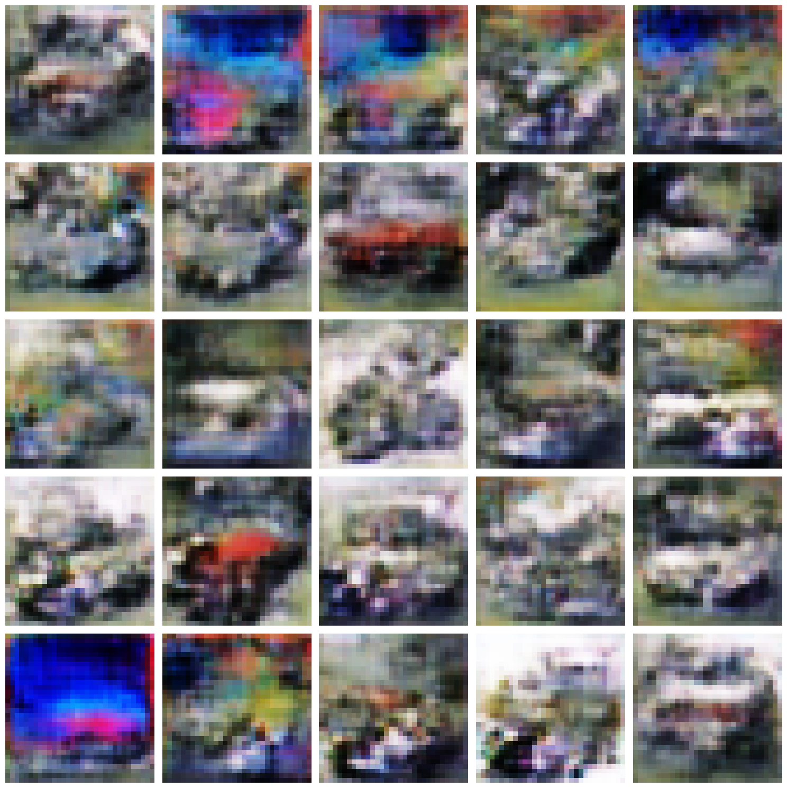

# Progressive GAN for Image Generation



## Project Overview

This project implements both a Vanilla GAN and a Progressive GAN (ProGAN) for generating realistic images from the CIFAR-10 dataset. The focus is on generating images of a single class (cars) using generative adversarial networks at progressively increasing resolutions.

## Key Features

- **Vanilla GAN Implementation**: Generates 32x32 car images directly using conventional GAN architecture
- **Progressive GAN (ProGAN) Implementation**: Implements a simplified version of the ProGAN approach, training at progressively higher resolutions (4x4 → 8x8 → 16x16 → 32x32)
- **Transfer Learning Between Resolutions**: Models trained at lower resolutions provide initializations for higher-resolution models
- **Detailed Visualization**: Includes loss tracking and image generation visualization at different stages of training

## Results

The project demonstrates the training process and outcomes of both GAN implementations:

- **Vanilla GAN**: Produces basic car shapes after 400 epochs of training
- **Progressive GAN**: Shows the progression of image quality from 4x4 resolution to 32x32 resolution

## Model Architecture

### Generator Architecture

The Generator transforms random noise vectors into realistic images:

```python
# Generator model
def build_generator():
    model = tf.keras.Sequential()
    model.add(layers.Dense(8 * 8 * 256, use_bias=False, input_shape=(100,)))
    model.add(layers.BatchNormalization())
    model.add(layers.LeakyReLU())
    model.add(layers.Reshape((8, 8, 256)))

    model.add(layers.Conv2DTranspose(128, (4,4), strides=(2,2), padding='same', use_bias=False))
    model.add(layers.BatchNormalization())
    model.add(layers.LeakyReLU())

    model.add(layers.Conv2DTranspose(64, (4,4), strides=(2,2), padding='same', use_bias=False))
    model.add(layers.BatchNormalization())
    model.add(layers.LeakyReLU())

    model.add(layers.Conv2DTranspose(3, (4,4), strides=(1,1), padding='same', activation='tanh'))

    return model
```

### Discriminator Architecture

The Discriminator differentiates between real and generated images:

```python
# Discriminator model
def build_discriminator():
    model = tf.keras.Sequential()
    model.add(layers.Conv2D(64, (4,4), strides=(2,2), padding='same', input_shape=[32, 32, 3]))
    model.add(layers.LeakyReLU())
    model.add(layers.Dropout(0.3))

    model.add(layers.Conv2D(128, (4,4), strides=(2,2), padding='same'))
    model.add(layers.LeakyReLU())
    model.add(layers.Dropout(0.3))

    model.add(layers.Flatten())
    model.add(layers.Dense(1))

    return model
```

## Progressive GAN Approach

The ProGAN implementation follows these key steps:

1. Train a GAN at 4x4 resolution
2. Use the trained weights to initialize an 8x8 resolution GAN
3. Continue to 16x16 and finally 32x32 resolution
4. Adjust hyperparameters (learning rate, etc.) at each resolution level

## Technologies Used

- TensorFlow 2.x
- Keras
- TensorFlow Datasets
- Matplotlib for visualization
- NumPy

## Training Process

The training process includes:

1. Loading and preprocessing the CIFAR-10 dataset (cars class)
2. Training the Vanilla GAN for 400 epochs
3. Training the ProGAN at each resolution stage (4x4, 8x8, 16x16, 32x32)
4. Visualizing the loss curves and generated images

## Challenges and Insights

- Training stability is a critical challenge in GAN implementations
- Progressive training helps establish stable low-resolution features before tackling higher-resolution details
- The complex structure of cars presents a particular challenge at the limited 32x32 resolution
- Careful hyperparameter tuning is essential for successful training

## Future Improvements

- Implement Wasserstein loss with gradient penalty for improved stability
- Add self-attention mechanisms to better capture spatial relationships
- Implement proper fade-in transitions between resolutions as in the original ProGAN paper
- Extend to higher resolutions (64x64, 128x128) for more detailed image generation
- Experiment with conditional GAN approaches for more guided generation


